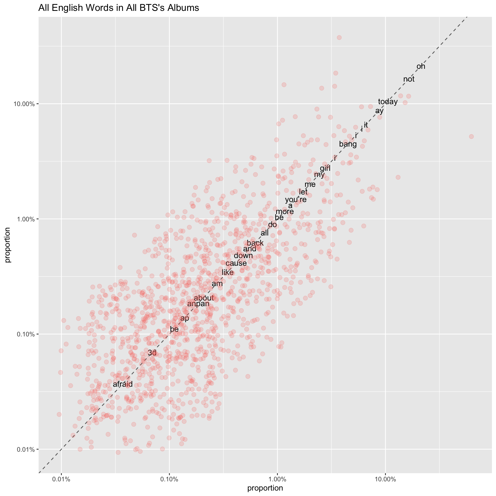
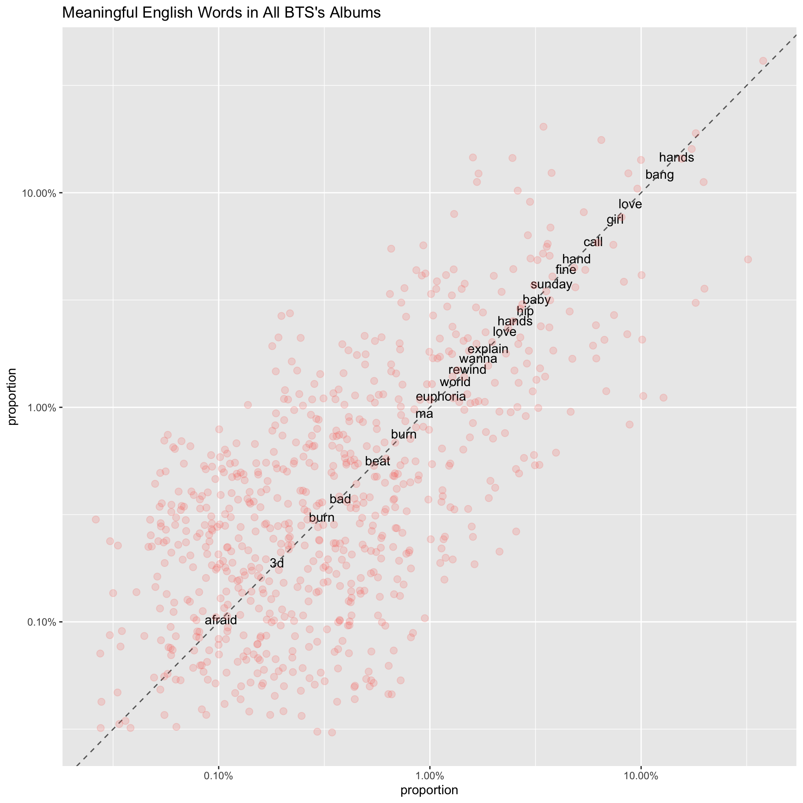
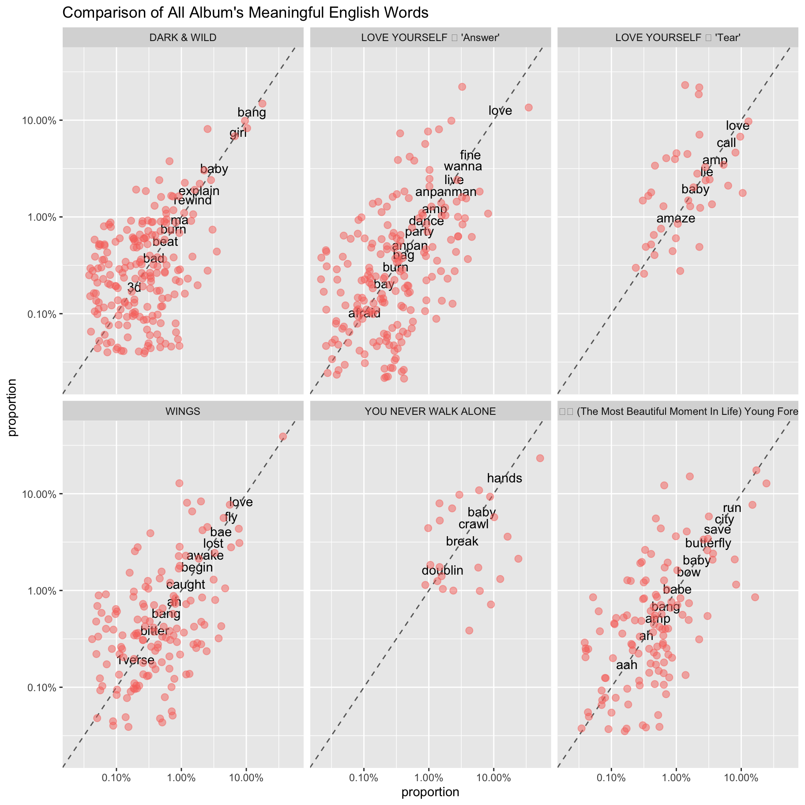

# Breaking Down BTS

As a k-pop fan since 2008, I’ve always been curious and amused with the
English words interspersed amongst the Korean lyrics. Do they always
make sense? *No.* But are they catchy? *Yes.*

I started my descriptive analysis with the current most popular K-Pop
boy band: BTS. I scraped all the lyrics from
[here](https://colorcodedlyrics.com/2014/01/bts-lyrics-index) (though I
did try the Genius R Package and AZ Lyrics, I ended up picking
ColorCodedLyrics for its simpler HTML format which helped a great deal
when parsing it into XML). With the guidance of [Text Mining with
R](https://www.tidytextmining.com/), I learned how to tokenize each
word, filter out the English words, and make beautiful graphs with them.
I also used the helper functions for rvest from
[here](https://github.com/tidyverse/rvest/issues/175#issuecomment-266434812)
to deal with parsing `<BR>` tags.

The raw data scraped from Color Coded Lyrics:

``` r
bts_songs_df
## # A tibble: 144 x 5
##    url               album_title release_date song_lyrics           song_title  
##    <chr>             <chr>       <date>       <chr>                 <chr>       
##  1 https://colorcod… DARK & WILD 2014-08-20   Come here I’m bout t… Intro: What…
##  2 https://colorcod… DARK & WILD 2014-08-20   You in danger  You i… Danger      
##  3 https://colorcod… DARK & WILD 2014-08-20   존재해 줘서 (참) 감사해   전화 … 호르몬전쟁  
##  4 https://colorcod… DARK & WILD 2014-08-20   It was a new world  … 힙합성애자  
##  5 https://colorcod… DARK & WILD 2014-08-20   마무리 된 이 선율 위에서   나 홀… Let Me Know 
##  6 https://colorcod… DARK & WILD 2014-08-20   (비가 오는 짙은 색 서울 그 위에)… Rain        
##  7 https://colorcod… DARK & WILD 2014-08-20   니가 무엇을 하든 I will kil… BTS Cypher …
##  8 https://colorcod… DARK & WILD 2014-08-20   뭐해      뭐해      뭐해… Interlude: …
##  9 https://colorcod… DARK & WILD 2014-08-20   핸드폰 좀 꺼줄래   모두가 스마트하… 핸드폰 좀 꺼줄래…
## 10 https://colorcod… DARK & WILD 2014-08-20   (One, two, three, fo… 이불킥      
## # … with 134 more rows
```

There were 47 total duplicate songs amongst the 6 albums and I removed
them because I wanted to analyze English lyrics from *unique* songs. The
data after tidying and finding each individual lyric:

``` r
tidy_bts_songs_df
## # A tibble: 24,232 x 6
##    url                        album_title release_date song_title    word    eng
##    <chr>                      <chr>       <date>       <chr>         <chr> <dbl>
##  1 https://colorcodedlyrics.… DARK & WILD 2014-08-20   Intro: What … come      1
##  2 https://colorcodedlyrics.… DARK & WILD 2014-08-20   Intro: What … here      1
##  3 https://colorcodedlyrics.… DARK & WILD 2014-08-20   Intro: What … i’m       1
##  4 https://colorcodedlyrics.… DARK & WILD 2014-08-20   Intro: What … bout      1
##  5 https://colorcodedlyrics.… DARK & WILD 2014-08-20   Intro: What … to        1
##  6 https://colorcodedlyrics.… DARK & WILD 2014-08-20   Intro: What … take      1
##  7 https://colorcodedlyrics.… DARK & WILD 2014-08-20   Intro: What … u         1
##  8 https://colorcodedlyrics.… DARK & WILD 2014-08-20   Intro: What … high…     1
##  9 https://colorcodedlyrics.… DARK & WILD 2014-08-20   Intro: What … we        1
## 10 https://colorcodedlyrics.… DARK & WILD 2014-08-20   Intro: What … about     1
## # … with 24,222 more rows
```

These are literally ***all*** the English words in all of their albums.
Some of the words are debatable in terms of whether they’re meaningful
English words like *oh* or *ay*.



I used the dataset `stop_words` from tidytext and added extra words to
that dataset to remove common words that aren’t as interesting for this
analysis:



Overall comparison amongst all the albums:


The most common words amongst all albums:

    ## # A tibble: 1,273 x 4
    ## # Groups:   album_title [6]
    ##    album_title                                            word      n proportion
    ##    <chr>                                                  <chr> <int>      <dbl>
    ##  1 LOVE YOURSELF 結 'Answer'                              you     153     0.0568
    ##  2 LOVE YOURSELF 結 'Answer'                              i       144     0.0534
    ##  3 LOVE YOURSELF 結 'Answer'                              love    124     0.0460
    ##  4 LOVE YOURSELF 結 'Answer'                              me       97     0.0360
    ##  5 LOVE YOURSELF 轉 'Tear'                                oh       97     0.214 
    ##  6 DARK & WILD                                            it       95     0.0659
    ##  7 WINGS                                                  i        87     0.0607
    ##  8 화양연화 (The Most Beautiful Moment In Life) Young Foreve… la       76     0.0557
    ##  9 DARK & WILD                                            la       72     0.0500
    ## 10 WINGS                                                  you      67     0.0467
    ## # … with 1,263 more rows

The most common ***meaningful*** words amongst all albums:

    ## # A tibble: 723 x 4
    ## # Groups:   album_title [6]
    ##    album_title                                            word      n proportion
    ##    <chr>                                                  <chr> <int>      <dbl>
    ##  1 LOVE YOURSELF 結 'Answer'                              love    124     0.127 
    ##  2 DARK & WILD                                            bang     65     0.123 
    ##  3 LOVE YOURSELF 結 'Answer'                              fine     43     0.0441
    ##  4 WINGS                                                  love     43     0.0838
    ##  5 화양연화 (The Most Beautiful Moment In Life) Young Foreve… run      42     0.0729
    ##  6 DARK & WILD                                            girl     40     0.0755
    ##  7 LOVE YOURSELF 結 'Answer'                              wanna    33     0.0339
    ##  8 LOVE YOURSELF 結 'Answer'                              yolo     32     0.0329
    ##  9 화양연화 (The Most Beautiful Moment In Life) Young Foreve… city     32     0.0556
    ## 10 화양연화 (The Most Beautiful Moment In Life) Young Foreve… girl     31     0.0538
    ## # … with 713 more rows

Some words like ‘love’ and ‘girl’ weren’t surprising to see amongst the
top used lyric but others like ‘bang’ and ‘yolo’ really contrasted with
that. This was my first webscraping project and I had lots of fun
learning and analyzing the lyrics. I plan to analyze more lyrics in the
future from BTS and other K-Pop girl groups and boy groups as well\!
